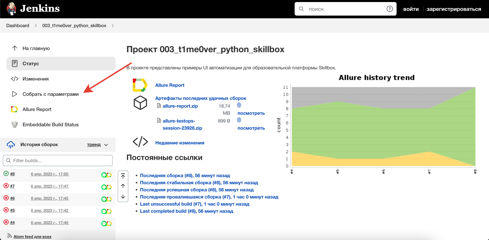
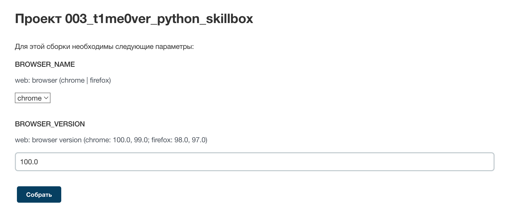
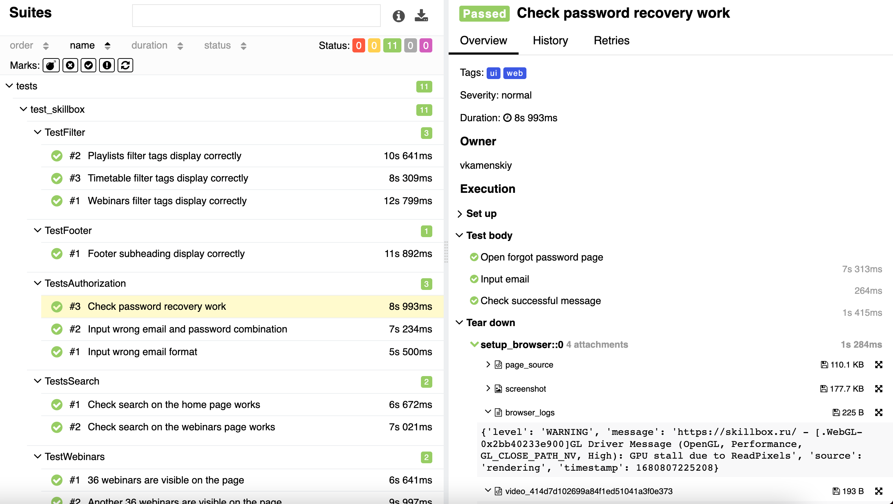
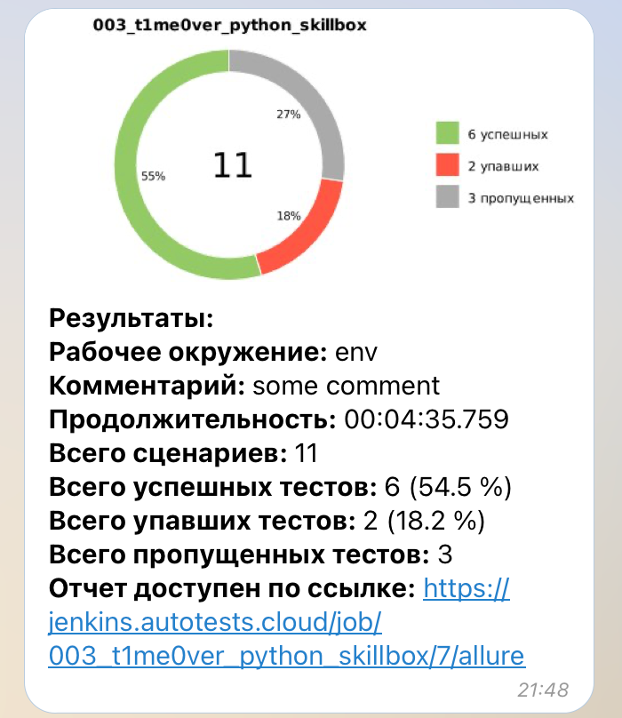
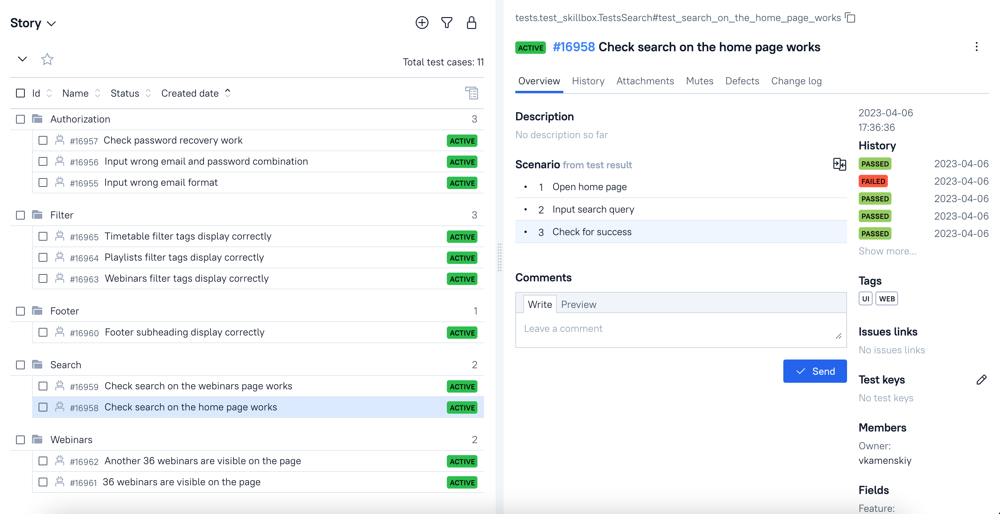
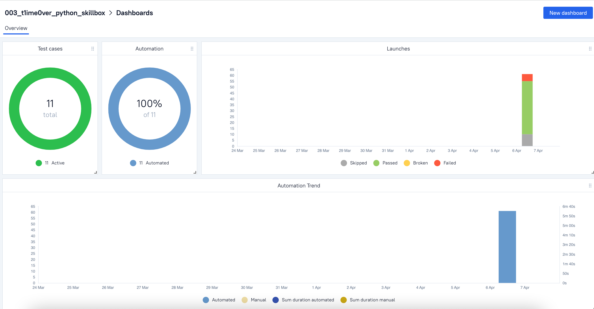

## Проект UI автотестов для образовательной платформы Skillbox

<!-- Описание -->

## :open_book: Описание
В проекте представлены примеры UI автоматизации тестирования на Python. 
<p>При написании тестов применялись инструменты объектно-ориентированной парадигмы, а также использовался шаблон 
проектирования PageObjects.
<p>Выделены тест-кейсы. Реализована параметризация тестов.
<p>Подключена система отчетности Allure Reports с вложениями (логи, скриншоты, видео, etc). 
<p>В тестах шаги отображены в виде лямбда-степов через with allure.step
<p>Также по факту прохождения теста отправляется уведомление с результатами в Telegram.
<p>Браузер в UI-тестах запускается удаленно в Selenoid.
<p>Реализована интеграция с Allure TestOps.

## :heavy_check_mark: Кратко
- [x] `Page Object`
- [x] `Application Manager`
- [x] Параметризованный запуск тестов
- [x] Self-documenting code
- [x] Запуск тестов, используя `Jenkins` и `Selenoid`
- [x] `Allure Reports` с вложениями (логи, скриншоты, видео)
- [x] Интеграция с `Allure TestOps`
- [x] Отправка результатов тестирования в `Telegram`

<!-- Технологии -->

## :gear: Используемые технологии
<p  align="center">
  <code></code>
  <code></code>
  <code></code>
  <code></code>
  <code></code>
  <code></code>
  <code></code>
  <code></code>
  <code></code>
  <code></code>
  <code></code>
  <code></code>
  <code></code>
</p>


<!-- Тест кейсы -->

## :heavy_check_mark: Что проверяют UI тесты

- [x] Проверка работы поиска на главной странице
- [x] Проверка работы поиска на странице вебинаров
- [x] Проверка отображения вебинаров
- [x] Проверка подзаголовков в футере сайта
- [x] Проверка отображения тегов фильтров
- [x] Проверка ввода неверного формата email
- [x] Проверка ввода неверного email и пароля
- [x] Проверка восстановления пароля


##  Запуск тестов из [Jenkins](https://jenkins.autotests.cloud/job/003_t1me0ver_python_skillbox/)

Для запуска тестов из Jenkins:
1. Нажмите кнопку "Собрать с параметрами"

<p></p>

2. Выберите параметры

<p></p>

3. Нажмите "Собрать"

## :computer: Локальный запуск 

1. Склонируйте репозиторий
2. Установите Poetry `poetry install`
3. Откройте проект в PyCharm, установите интерпретатор
4. Создайте `.env` файл по образцу в папке проекта
5. Запустите тесты в PyCharm или в командной строке (не забудьте подставить нужные параметры):
```bash
pytest --browser_name={BROWSER_NAME} --browser_version={BROWSER_VERSION} --alluredir allure-results/
```

### :heavy_plus_sign: Параметры сборки

> - BROWSER_NAME — браузер _(Chrome, Firefox)_, по умолчанию Chrome
> - BROWSER_VERSION — версия браузера _(chrome: 100.0, 99.0; firefox: 98.0, 97.0)_, по умолчанию 100.0

## :bar_chart: Отчеты о прохождении тестов доступны в Allure

> При локальном запуске введите в командной строке: 
```bash
allure serve 
```

###  Allure

#### Примеры отображения тестов



###  Telegram

Настроена отправка отчета в Telegram



## :briefcase: Проект интегрирован с Allure TestOps 

#### Автоматически собраны тест-кейсы



#### Представлены дашборды аналитики


